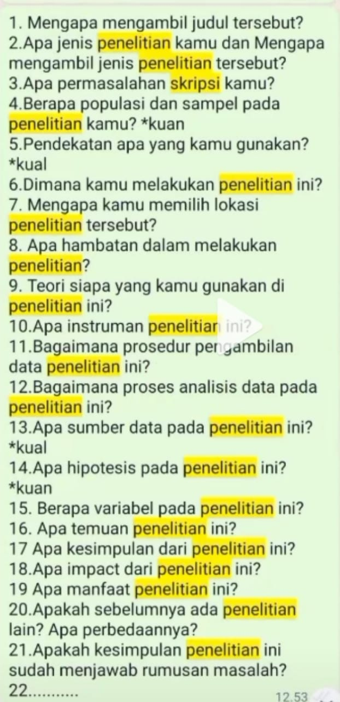

# Table of Contents
- [RANDOM STUFF](#random-stuff)
- [DESIGN](#design)
  - [UI](#ui)
  - [UX](#ux)
- [ASSETS](#assets)
  - [Image](#image)
  - [Video](#video)
- [PROGRAMMING](#programming)
  - [Challenge](#challenge)
  - [Mobile](#mobile)
  - [Front-end](#front-end)
    - [CSS](#css)
    - [Javascript](#javascript)
  - [Back-end](#back-end)
  - [Other](#other)
  - [Data Structures & Algorithms](#data-structure-&-algorithm)
  - [Database](#database)
- [TEMPORAL](#temporal)
- [FREE STUFF](#free-stuff)
- [ARTICLE](#article)
- [KULIAH](#Kuliah)
- [WORK](#work)

---

# RANDOM STUFF

Scrolling-text-time-waster = https://patorjk.com/misc/scrollingtext/timewaster.php

human body = [https://smart.servier.com/](https://smart.servier.com/)

learn-psychology = https://nobaproject.com/

Google_fun= emupedia, weavesilk, interland, littlealchemy, drawinggarden, flashbynight, worldmeter, patatap, mrdoob, davidl

AI video= [synthesia.io](http://synthesia.io/), [rephrase.ai](http://rephrase.ai/), [spik.ai](http://spik.ai/), [dictation.io](http://dictation.io/),

AI-music-generator = https://www.beatoven.ai/

AI-image-generator = https://www.craiyon.com/, https://www.wombo.art/

brief-generator = https://goodbrief.io/

Video_quote= [Playphraseme](https://www.playphrase.me/)

shortcut = [https://shortcuts.design/](https://shortcuts.design/)

random-logo= [https://logoipsum.com/](https://logoipsum.com/)

Text-to-Speech= [https://notevibes.com/](https://notevibes.com/), [https://fakeyou.com/](https://fakeyou.com/)

vocal-instrument-separate = [https://www.lalal.ai/](https://www.lalal.ai/)

Rakit_pc= pcpartpicker

Founder= foundercontent

Tools= neontools, uberduckai

Bussinesnamegenerator= Namelix

Brand= brandingstyleguide, https://brandfetch.com/

Bikin_rumah= roomstyler

Bikin_kemasan_produk= Templatemaker.nl

Bapenda jabar

IP-tracking= grabify.link

Unknown= ihateregex.io

Komparasi_file= textcompare

Kombo_keyboard= Shortcuts.design

Tanpa_install= neverinstall.com

AI video= synthesia.io, rephrase.ai, spik.ai, dictation.io

Cari_muka_orang= pimpeyes

Papan_tulis= witeboard.com

Bagi_file= wetransfer.com

Emosi= Emotionchart

Langganan= seakunid

Video_quote= Playphraseme

random-logo= https://logoipsum.com/

run-app-without-install = https://neverinstall.com/

alternative = https://www.opensourcealternative.to/

browser-automation = https://axiom.ai/

resource = https://10015.io/

AI-voice = Coqui.ai 

Splithsong = https://www.splitmysong.com/

Ethical hacking = vulnhub.com

https://killedbygoogle.com/ 

github = https://socialify.git.ci/

excel = https://excelunusual.com/

radio = [http://radio.garden/](http://radio.garden/)

content-generator-ai = https://www.copy.ai/

ai-words = https://quillbot.com/

introverts = https://lifeat.io/explore, https://www.window-swap.com/

marketing = https://marketingexamples.com/

learn-things = https://www.classcentral.com/

structuring-service = https://prohura.com/

simple-AWS = https://digger.dev/

learn-anything = https://learn-anything.xyz/

FPS-game = https://app.3daimtrainer.com/quick-play

Learn-language = [Japan](https://easyjapanese.net/)

Github badge\
[classic badge](https://badgen.net/)

Freelance\
[designer+freelance](https://eveerykit.com/product-category/for-designer-freelancer/)

Archive\
[Internet Archive](https://archive.org/)

[Window somewhere in the world](https://www.window-swap.com/)

[Walk in cities somewhere in the world](https://citywalks.live/)

[Drive somewhere in the world](https://drivenlisten.com/#)

[Drive somewhere in the world 2](https://driveandlisten.herokuapp.com/)

[Explore movie color](https://thecolorsofmotion.com/)

[Human anatomy](https://www.innerbody.com/htm/body.html)

[Scale of the universe](https://htwins.net/scale2/)

[My 2000's Tv](https://www.my00stv.com/#)

--

ssr ssg spa

astro build

nextjs

qwik

serverless function

tailwind, sass, windi css, mantine. daisy ui

firebase

aws amplify, mongodb realm, nhost, supabase, appwrite

cloud firestore, planetscale, cockrouchdb, prisma

redis, cassandra

cypress, playwright, vitest

sendgrid, algolia

stripe, paypal

eslinter

database, user auth

web server : nginx, apache

iaas, paas, baas, sass

--

--

https://webcode.tools/\
https://frontendchecklist.io/\
https://sketch2code.azurewebsites.net/\
https://unused-css.com/\
https://www.magicpattern.design/tools\
https://coolbackgrounds.io/\
https://wickedbackgrounds.com/app\
https://www.shapedivider.app/\
https://www.uidesigndaily.com/\
https://spline.design/\
https://lawsofux.com/en/\
https://animista.net/\
https://screenlane.com/
https://froala.com/design-blocks/\
https://3dicons.co/\
https://collectui.com/\
https://www.humaaans.com/\
https://www.checklist.design/\
https://webgradients.com/\
https://webframe.xyz/\
https://www.lapa.ninja/

--

???
https://jsdares.com/\
https://codecombat.com/\
https://freecodecamp.itch.io/learn-to-code-rpg\
https://javascriptquiz.com/\
https://screeps.com/\
https://flukeout.github.io/\
https://mastery.games/\
https://codepip.com/games/\
https://openvim.com/\
https://codingfantasy.com/games\
https://knightsoftheflexboxtable.com/\
https://katydecorah.com/css-ruler/\
https://typescript-exercises.github.io/\
https://designpatternsgame.com/\
https://react-tutorial.app/\
https://bevacqua.github.io/promisees/\
https://learngitbranching.js.org/\
https://selectstarsql.com/\
https://regex101.com/\
https://regexcrossword.com/\
https://regexone.com/\
https://lab.reaal.me/jsrobot/\
http://www.crunchzilla.com/\

# DESIGN

Visual Design\
[design system repo](https://designsystemsrepo.com/), [atlasian design](https://atlassian.design/), [material design](https://material.io/), [primer style](https://primer.style/), [spectrum adobe](https://spectrum.adobe.com/), [Microsoft fluent design system](https://www.microsoft.com/design/fluent/), [human interface guidlines by apple](https://developer.apple.com/design/human-interface-guidelines/), [carbon design system by ibm](https://www.carbondesignsystem.com/), [salesforce lightning design system](https://www.lightningdesignsystem.com/), [dark mode design](https://www.darkmodedesign.com/)

Design System\
[google material design](https://m3.material.io/), [Apple human interface guidelines](https://developer.apple.com/design/human-interface-guidelines/platforms/overview), [atlasian design system](https://atlassian.design/), [pajamas gitlab design system](https://design.gitlab.com/), [firefox photon design system](https://design.firefox.com/photon/), [mailchimp patter library](https://ux.mailchimp.com/patterns/color), [uniform hudl design](http://uniform.hudltools.com/), [thumbprint design system](https://thumbprint.design/), [rizzo lonely planet](https://adele.uxpin.com/lonely-planet-rizzo), [carbon design system](https://carbondesignsystem.com/), [stackoverflow design](https://stackoverflow.design/), [audi user interface](https://www.audi.com/ci/en/guides/user-interface/introduction.html), [bbc GEL](https://www.bbc.co.uk/gel/guidelines), [hubspot canvas design system](https://canvas.hubspot.com/), [ant design](https://ant.design/), [polaris shopify](https://polaris.shopify.com/), [grommet](https://v2.grommet.io/), [marvelapp styleguide](https://marvelapp.com/styleguide/overview/introduction), [garden zendesk](https://garden.zendesk.com/), [salesforce ligthning design sytem](https://www.lightningdesignsystem.com/), [uber base web](https://baseweb.design/), [gojek ashpalt aloha](https://asphalt.gojek.io/), [orbit kiwi](https://orbit.kiwi/), [microsoft fluent UI](https://developer.microsoft.com/en-us/fluentui#/), [patternfly](https://www.patternfly.org/v4/), [pega constellation](https://design.pega.com/), [gold australia design system](https://gold.designsystemau.org/), [mozilla protocol](https://protocol.mozilla.org/), [intuit quickbooks](https://designsystem.quickbooks.com/), [workday canvas](https://canvas.workday.com/), [yelp cookbook](https://www.yelp.com/styleguide), [airbnb visual language](https://airbnb.design/building-a-visual-language/), [spectrum adobe](https://spectrum.adobe.com/), [lexicon liferay design](https://liferay.design/lexicon/), [microsoft fluent](https://www.microsoft.com/design/fluent/), [solid buzzfeed](https://solid.buzzfeed.com/), [mongodb ui design](https://www.mongodb.design/#/ui-design-system/welcome), [mixpanel design](https://design.mixpanel.com/), [solar bulb design](https://design.bulb.co.uk/), [oracle alta UI](https://www.oracle.com/webfolder/ux/middleware/alta/index.html), [latitude flexport design](https://www.flexport.com/design), [sap fiori design](https://experience.sap.com/fiori-design-web/), [evergreen segment design](https://evergreen.segment.com/), [clarity design](https://clarity.design/)

Design Style\
synthwave, vaporwave, trippy

Principles\
[design principles](https://principles.design/)

Logo Generator\
[logology](https://www.logology.co/), [tailorbrands](https://www.tailorbrands.com/logo-maker), [artify](https://www.artify.co/), [shopify](https://www.shopify.com/tools/logo-maker)

Illustration 2D\
[sketchvalley](https://sketchvalley.com/)

Illustration 3D\
[shapefest](https://www.shapefest.com/)

## UI 

UI/UX= app.uxcel.com, uizard, Proto.io, design system in UI UX, cantunsee.space, type.method.ac, uxcel.com, uxtweak, https://www.uidesigndaily.com/ https://uxtools.co/ https://www.uplabs.com/, https://userpersona.design/
https://penpot.app/

https://material.io/

https://www.geometrize.co.uk/

https://stellarium-web.org/

https://www.solarsystemscope.com/

https://stars.chromeexperiments.com/

https://www.dailyui.co/

https://advntr.co/

https://lawsofux.com

https://www.useronboard.com/onboarding-ux-patterns/

Pattern\
http://uipatterns.io/, https://uxchecklist.github.io/

## UX
https://uxtools.co/

# ASSETS

Skeletal Animation\
[dragonbone](https://docs.egret.com/dragonbones/en/)

## Image

Tool\
https://haikei.app/

Background= coolbackground.io, transparenttexture, heropatterns, https://www.svgbackgrounds.com/ https://gradienta.io/ https://www.visiwig.com/patterns/ https://patternpad.com/ https://bgjar.com/ https://pattern.monster

image_to_text = https://www.text-image.com/convert/

image_to_geometric_primitive = https://www.geometrize.co.uk/

animated-drawing = https://sketch.metademolab.com/

create art: https://creator.nightcafe.studio/

Maps\
https://pictogon.com/

Pattern\
https://patternpad.com/

AI Drawing\
[autodraw](https://www.autodraw.com/)

## Video

video_to_text = https://anthiago.com/transcript/

asset-music= https://mixkit.co/

asset-video= http://coverr.co/

Abstract = Tool.graphics

Apus_objek= theinpaint, removebg, Nvidia inpainting

Edit_video_online= http://veed.io/, davinciresolve, makewebvideo, natron, jittervideo, unscreen, goanimate, animatron, inshot

Icon = https://tablericons.com/, https://tabler-icons.io/

Motiongraphics= lottiefiles

Make_music= onlinesequencer, http://mubert.com/, https://samplefocus.com/, vocalremoverorg, http://lalal.ai/,

Subtitle= kapwing, http://veed.io/, descript

palet-warna = https://www.happyhues.co/, https://colors.dopely.top/

VIDEO-EDITING = https://origami.design/, descript

--

Tool.graphics

auto_gambar= https://www.autodraw.com/

Fileconverter= cloudconvert.com

Jual= creativemarket, ui8net, uplab, envato, template master, canva, etsy, designcrowd, 99design, fiverr

Inspiration = designinspiration.com, Behance, pinterest, dribbble, muz.li, savee.it , metmuseum, namelix, uigarage, unreaddesign, awwwards, mobbin.design

3D= spline.design, Toyfaces3d, avatarz, bigsuricon, morquastore, 3dmockups, 3diconsset, shapefest, superscene.pro, heroforge, polywork.com, maze.co, icon8 3D hand, anicons, artify 3d lettering, morquastore 3d, glaze 3d icon, iconscout3d

Mockup= Mockupphone, shotsnapp, mockvideo, vecteezy, rotato.xyz, thing.morflax.com, artboartstudio, mockupbro, devicesshots, previewedapp, threedio, smartmockups, screenly, mockups-design, free-mockup, graphicburger, mockupworld, graphberry, freepik, ls.graphics, mckups, placeit.net, pixeden, mockuuups.studio, mockup.ceacle.com, medialoot, freebiesbug, cssauthor, unblast, rawpixel,

Convert_vector= Vectorizerio

Ai_image_resolution= letsenhance.io

Image_size= tinypng

Fontpair= fontjoy, fontpair.co

Font-view = https://type-scale.com/, https://wordmark.it/, https://www.fontbrief.com/

Font= metaflop, fontgoogle, fontspace, pairingfont, fontshare, fontesk, fontinuse, https://type-scale.com/

Google_fun= emupedia, weavesilk, interland, littlealchemy, drawinggarden, flashbynight, worldmeter, patatap, mrdoob, davidl

Gambar_organ_tubuh= Servier medical art

Iklan_produk= breakoutclips

Packing= qualita_company

Perkecil_size_file= tinypng.com

Pixel= https://www.pixelartcss.com/

Svg= svgomg

Foto/vid= Drawkit, svggator, humaaans, undraw, unsplash, pixabay, pexels, icons8, Isoflat, rawpixel, amritpaldesign, appitgdigital, isometriclove, Freepik, vecteezy, handzdesign, pixabay,isoflat, graphicburger, pixeden

Icon= nucleoapp.com, feathericons.com, icons8, ui8.net/category/icons, streamlineicons.com, iconscout.com, animaticons, akaricons, thenounproject, https://www.iconfinder.com/, https://systemuicons.com/, iconsaxio, lordicon, , Iconstore, iconfinder, streamlineicon, lordicon, remixicon, appitgdigital, ikonate, fontawesome.

PNG= Pngpix , favpng, Subpng, pngtree, cleanpng.

Illustrations= drawkit, opendoodle, blushdesign, illustation, opendoodles, pixeltrue, undraw, humaaans, skribl, Sketchvalley, ls-graphics, storytale.io error, manipixels.co, https://themeisle.com/illustrations/

illustration: blush.design, drawkit.io, humaaans.com, icons8.com, iconscout.com, illustrations.co, iradesign.io, isometric .nline, manypixels.co, openpeeps.com, pixeltrue.com, storyset.com, undraw.co 

Warna= khroma, mycolor.space, colorhuntco, color.adobe, coolorsco, swiss style color picker, apptunix, whocanuse, contrastchecker, uicolors, colorscafe, colorsevadesign,

Gradient= meshgradient, cssgradient.io,

asset-music= https://mixkit.co/

asset-video= coverr.co

Animasi= createwithflow, Render forest, animaker, gsap, greensock

Edit_opening_video= panzoid

Subtitle= kapwing, veed.io, descript

Motiongraphics= lottiefiles

VIDEO-EDITING = https://origami.design/, descript

Edit_video_online= veed.io, davinciresolve, makewebvideo, natron, jittervideo, unscreen, goanimate, animatron, inshot

Edit_foto= fotor, photopea

Apus_objek= theinpaint, removebg, Nvidia inpainting

Photo_tracking= pixsy

Make_music= onlinesequencer, mubert.com https://samplefocus.com/ vocalremoverorg, lalal.ai,

Draw_online= sketch.io, photopea, fotor
Text-to-Speech= https://notevibes.com/, https://fakeyou.com/

Cool\
Trippy edit

--

https://kleki.com/

## Music\
thirtydollar.website, specy.github.io/genshinMusic/#/

# PROGRAMMING

Design Pattern\
https://refactoring.guru/design-patterns/, http://www.mcdonaldland.info/2007/11/28/40/, https://www.cs.cmu.edu/~charlie/courses/15-214/2016-spring/slides/24%20-%20All%20the%20GoF%20Patterns.pdf, https://www.patterns.dev/

web3: app.stackup.dev, Learnweb3.io, cryptozombies.io, buildspace.so, questbookapp.xyz, nftschool.dev, remix.ethereum.org, ethernaut.openzeppelin.com,solanacookbook.com, useweb3.xyz, buildspace.io, https://www.useweb3.xyz/

buildFastFUllStackWebApps = https://glitch.com/

profileMarkdown = https://www.profileme.dev/

create-markdown = https://pandao.github.io/editor.md/en.html

Programming-logic = https://circuitverse.org/simulator

Real-time-sharecode = https://codeshare.io/

Code-review-as-a-Service = https://www.pullrequest.com/

documenting = https://www.bookstackapp.com/

software-architect = https://www.freecodecamp.org/news/an-introduction-to-software-architecture-patterns/

learn-about-the-web = https://howhttps.works/, https://howdns.works/

game-in-web = https://donitz.itch.io/

Deploy Website\
[render](https://render.com/), [heroku](https://www.heroku.com/), [netlify](https://www.netlify.com/), [vercel](https://vercel.com/), [surge sh](https://surge.sh/)

books = the algorithm design manual 3rd edition

algorithmic-art = https://www.ventrella.com/

Git\
[most frequently ask](https://firstaidgit.io/#/)

Linux\
[learn linux survival](https://linuxsurvival.com/)

Museum\
https://www.kapwing.com/museum-of-websites

Open-Source\
[notification infrastucture](https://novu.co/)

Snippet\
https://ray.so/

Tools\
https://landingpage.fyi/

## CHALLENGE

CSS\
[css battle](https://cssbattle.dev/), [css diner](https://flukeout.github.io/), [flexbox defense](http://www.flexboxdefense.com/), [css garden](https://cssgridgarden.com/#id)

Data Structures and Algorithms\
[leetcode](https://leetcode.com/problemset/all/), [hackerrank](https://www.hackerrank.com), [codewars](https://www.codewars.com/), [algo monster](https://algo.monster/), [neetcode](https://neetcode.io/), [exercism](https://exercism.org), [kaggle data science](https://www.kaggle.com/)

Typing\
[ztype](https://zty.pe/)

FREE STUFF

https://exercism.org/

[teachyourselfcs.com](https://teachyourselfcs.com/)

https://freestuff.dev/

https://free-for.dev/#/

https://learnxinyminutes.com/docs/javascript/

https://web.dev/

https://hackr.io/

https://egghead.io/

https://scrimba.com/allcourses?price=free

Online-tools-for-dev = https://extendsclass.com/

## **Mobile**

https://cordova.apache.org/

## **Front-end**

3D\
[spline](https://spline.design/), [p3d](https://p3d.in/), [sketchfab](https://sketchfab.com/), [cannonjs](http://www.cannonjs.org/), [draco](https://google.github.io/draco/)

create-frontEnd-fast = https://www.editorx.com/

Design-to-webapps = https://www.locofy.ai/

React = https://mui.com/

metatags = https://metatags.io/

checklist = https://frontendchecklist.io/, https://www.checklist.design/, https://www.designsystemchecklist.com/

HTML = https://htmlcheatsheet.com/, https://www.w3.org/TR/2011/WD-html5-20110525/content-models.html, https://htmldog.com/

web-background = https://webgradients.com/, https://bgjar.com/

Testing = cypress, enzymjs, jest

https://webdevelopermentor.com/challenges/notifications-menu

https://spline.design/

https://mantine.dev/

react-libraries = https://reactlibraries.com/

typescript-hooks = https://usehooks-ts.com/

html-canvas = https://playcanvas.com/

pwa-example\
[appscope](https://appsco.pe/)

Component\
https://uiplaybook.dev/

Website Accessibility\
https://www.a11y-101.com/

### ***CSS***

CSS-ultimate = [https://angrytools.com/](https://angrytools.com/)

CSS-play = [https://cssgridgarden.com/#id](https://cssgridgarden.com/#id), [https://flukeout.github.io/](https://flukeout.github.io/), [https://flexboxfroggy.com/#id](https://flexboxfroggy.com/#id), [http://www.flexboxdefense.com/](http://www.flexboxdefense.com/), [https://mastery.games/flexboxzombies/](https://mastery.games/flexboxzombies/)

CSS-tips = [https://moderncss.dev/](https://moderncss.dev/)

CSS-cubic-bezier = [easings.net](https://easings.net/)

CSS-pixel = [https://www.pixelartcss.com/](https://www.pixelartcss.com/)

CSS-animation = [https://animista.net/](https://animista.net/), [https://animate.style/](https://animate.style/), [https://keyframes.app/](https://keyframes.app/), [https://www.minimamente.com/project/magic/](https://www.minimamente.com/project/magic/), [https://whirl.netlify.app/](https://whirl.netlify.app/), [https://loading.io](https://loading.io/)

CSS-bem = [https://9elements.com/bem-cheat-sheet/](https://9elements.com/bem-cheat-sheet/)

CSS-challenge = [https://cssbattle.dev/](https://cssbattle.dev/), [https://100dayscss.com/](https://100dayscss.com/), [https://www.codewars.com/dashboard](https://www.codewars.com/dashboard)

CSS-grid = [https://www.layoutit.com/cn](https://www.layoutit.com/cn), [https://griddy.io/](https://griddy.io/), [https://cssgr.id/](https://cssgr.id/), [https://cssgrid-generator.netlify.app/](https://cssgrid-generator.netlify.app/), [https://gridbyexample.com/](https://gridbyexample.com/)

CSS-flexbox = [https://loading.io/flexbox/](https://loading.io/flexbox/)

CSS-layout-pattern = [https://csslayout.io/](https://csslayout.io/)

CSS-generator-shadow = [https://shadows.brumm.af/](https://shadows.brumm.af/)

https://github.com/IanLunn/Hover/blob/master/css/hover.css

https://grid.malven.co/

https://cssgrid-generator.netlify.app/

https://animate.style/

https://templatemo.com/

https://designmodo.com/css-website-designs/

https://100dayscss.com/

https://dailycssdesign.com/

https://cssbud.com/css-generator/css-glow-generator/

https://shadows.brumm.af/

https://rupl.github.io/unfold/

CSS\
https://html-css-js.com/css/generator/,
https://webcode.tools/,
https://www.toptal.com/developers/css3maker,
http://css3generator.com/,
https://www.cssmatic.com/,
https://enjoycss.com/,
http://css3studio.com/page-css3/css-box-shadow.php,
https://keyframes.app/,
https://waitanimate.wstone.uk/,
https://animista.net/,
https://animista.net/,
https://www.transition.style/

Background\
http://www.patternify.com/,
http://dragdropsite.github.io/waterpipe.js/,
https://bgjar.com/,
https://stripesgenerator.com/,

Border\
https://9elements.github.io/fancy-border-radius/,
https://mdbootstrap.com/docs/standard/tools/design/fancy-border-radius/,
https://codepen.io/amit_sheen/pen/xxZeyjO,

Box-shadow\
https://shadows.brumm.af/,
https://htmlcssfreebies.com/box-shadow-generator-multiple/,
https://cssbud.com/css-generator/css-box-shadow-generator/,
https://getcssscan.com/css-box-shadow-examples,
https://cssbud.com/css-generator/css-glow-generator/

Button\
https://cssbuttoncreator.com/,
https://www.bestcssbuttongenerator.com/,
https://css-tricks.com/examples/ButtonMaker/,
https://getcssscan.com/css-buttons-examples,
https://gradientbuttons.colorion.co/,
https://markodenic.com/tools/buttons-generator/,

Dividers\
https://wweb.dev/resources/css-separator-generator/,
https://www.shapedivider.app/,
https://getwaves.io/

Filters\
https://www.cssfilters.co/,
https://baseline.is/tools/css-photo-filters/,
https://hero-generator.netlify.app/

Gradients\
https://cssgradient.io/,
https://www.colorzilla.com/gradient-editor/,
https://meshgradient.com/,
https://www.gradientos.app/

Layuots\
https://layout.bradwoods.io/,
https://the-echoplex.net/flexyboxes/,
https://cssgrid-generator.netlify.app/,
https://codepen.io/michellebarker/full/zYOMYWv,
https://grid.layoutit.com/

Palletes\
https://coolors.co/

Tools\
https://omatsuri.app/,
http://eky.hk/,
https://doodlenerd.com/,
https://www.cssportal.com/,
https://cssbud.com/,
https://10015.io/

Typography\
http://csstypeset.com/

Underline\
https://underline-generator.netlify.app/?ref=undesign,
https://cssbud.com/css-generator/css-underline-generator/

Generator\
https://ui.glass/generator/,
https://css.glass/,
https://neumorphism.io/#e0e0e0,
https://neumorphic.design/,
https://jnkkkk.github.io/MoreToggles.css/,
https://3dbookcovergenerator.netlify.app/,
https://jonsuh.com/hamburgers/,
https://divtable.com/table-styler/,
https://10015.io/tools/css-loader-generator

Chart\
https://chartscss.org/	

Loading\
https://whirl.netlify.app/,
https://loading.io/

Color\
https://codepen.io/TajShireen/pen/YzZmbep

Accordion\
https://accordionslider.com/

Pixel\
https://www.pixelartcss.com/

Theme\
https://theme.numl.design/

Blob\
https://www.blobmaker.app/

### ***Javascript***

JS-dom = https://htmldom.dev/

JS-utility = https://1loc.dev/

JS-learn = https://javascript.info/

https://www.jsv9000.app/

https://javascript.info/

https://javascripttutorial.net/

https://learn-js.org/en/

https://javascript30.com/

https://jstherightway.org/

## **Back-end**

API= publicapis, https://directus.io/, https://opentdb.com/

NPM = http://bundlephobia.com/,

test-api = https://jsonplaceholder.typicode.com/, https://pie.dev/, https://dummyjson.com/

https://regexr.com/

nodejs = https://nodejsera.com/30-days-of-node.html

## **Other**

ultimate-resource = [https://www.devresourc.es/,](https://www.devresourc.es/) [designresourc.es](http://designresourc.es/), [smalldev.tools](https://smalldev.tools/), [omatsuri.app](https://omatsuri.app/), [https://tiny-helpers.dev/](https://tiny-helpers.dev/), https://devtooly.com/

ultimate-learn = [https://learnxinyminutes.com/](https://learnxinyminutes.com/)

readme = [https://readme.so/id/editor](https://readme.so/id/editor)

usage = [https://uses.tech/](https://uses.tech/)

documentation = [overapi.com](http://overapi.com/), [devdocs.io](http://devdocs.io/), [devhints.io](http://devhints.io/), [https://ihateregex.io/](https://ihateregex.io/)

documentation = [https://explainshell.com/](https://explainshell.com/)

Learn-by-games= codingame, coregame, [codecombat.com](http://codecombat.com/), [education.minecraft.net](http://education.minecraft.net/), [tynker.com](http://tynker.com/), [checkio.org](http://checkio.org/), jsrobot, robocode, checkio, codingame, jsdares, codecombat, flexboxfroggy, cssdiner, elevatorsaga, crunchzilla, sql murder mystery, warriorjs, [https://www.codewars.com/dashboard](https://www.codewars.com/dashboard)

createSnippet = [Carbon.now.sh](http://carbon.now.sh/), [ray.so](http://ray.so/),

reference = [https://mobbin.design/browse/android/apps](https://mobbin.design/browse/android/apps), [https://stackshare.io/stacks](https://stackshare.io/stacks)

socialSearchEngine = [https://www.social-searcher.com/](https://www.social-searcher.com/)

whatsTheDifference = [https://thisthat.dev/](https://thisthat.dev/)

screen-size = [screensizemap.com](https://screensizemap.com/)

learn-math = [https://projecteuler.net/](https://projecteuler.net/)

git = [https://learngitbranching.js.org/,](https://learngitbranching.js.org/) [https://readme.so/id](https://readme.so/id)

git= Ohshitgit

--
Web_tools= hiddentools.dev

Understanding-frontend= Thisvsthat.dev, webcomponents.org https://uses.tech/

Tentang_shell= explainshell.com Documentation

Improve_web= caniuse.com, devhints.io, Bundlephobia.com

Tes_frontend= enzymjs, jest, cypress

Tes_website= caniuse.com, builtwith.com, pagespeedinsights, https://nibbler.silktide.com/

Inspiration= siteinspire, designresourc.es, https://www.saasframe.io/

Web_sama= similarsites.com

Fileconverter= cloudconvert.com

Artificial intelligence= tensorflow

API= publicapis, insomniarest.

Node= reactsimpleimg

Code_Game= codingame, coregame, codecombat.com, education.minecraft.net, tynker.com, checkio.org

Learncode_by_game= jdrobot, robocode, checkio, codingame, jsdares, codecombat, screeps, flexboxfroggy, cssdiner, untrustedjavascript, elevatorsaga, crunchzilla, sql murder mystery, warriorjs.

Code_snippet= Carbon.now.sh, ray.so,

Build_app= https://teta.so/, glideapps, bravoatudioapp, draftbit, animaapp, sketch2react

Build_webapp= bubble.io

Belajar_code= 100dayscss, top,geeksforgeeks, cssbattle, , frontend practice, codingchallenges, stylestage, frontend mentor, codewars, hackr.io, Code4startup.com

Bikin_web= graphite.space, Webflow, wix, wordpress, godaddy, weebly, typedream

Trend= mobbindesign, Gtrend, audience insight, socialsearcher

SEO_tools= semrush, googlesearchconsole, ubersuggest, Yoast, answerthepublic, gtmetrix, seoquake, metatags, dailypurposes, notjustanalytics, hashtagstacks, all-hashtag, ingramer,

--

--

Tools= https://smalldev.tools/, https://omatsuri.app/

Responsive-Web= https://responsively.app/

Frontend= Gitignoreio, frontendchecklistio

Naming= codeelf

responsive_design= Screensizemap.com,

Website_template= nicepage, colorlib, freecss, tooplate, ostemplate

Learn= Thisvsthat, webcomponents.org,

HTML= Htmldog, htmlcheatsheet.com, htmldom.dev https://www.w3.org/TR/2011/WD-html5-20110525/content-models.html

JavaScript= https://1loc.dev/ https://www.javascripting.com/?sort=rating https://learnxinyminutes.com/docs/javascript/

NPM= bundlephobia,

React_animation_demo= https://react-animations.herokuapp.com/

JavaScript_libraries= fullpagejs, animejs, threejs, screenfulljs, leafletjs, popperjs

Animation_CSS= easings.net

CSS= css-tricks, cssbattle, flexboxfroggy, cssdiner, bemcheatsheet, cssdiner, rupl-unfold, cssgridgarden, flexboxdefense, victordarras-cssgame, cssfiltergenerator, kerframeapp, Animateresource, whirlnetlify, minimamente, jonsuh-hamburger, animate.style, ianlunn-hover, greensock-gsap, zurb-motionui

CSS_layout= gridlayoutit, csslayout.io, griddy.io, purecsslayouts, CSSgridgenerator, loadingioflexbox, cssgr.id, gridbyexample,

Cssbackground= https://dragdropsite.github.io/waterpipe.js/ Bgjar.com webgradients.com 

CSSpixel= https://www.pixelartcss.com/

HTML CSS generator= webcode.tools, tridiv.com

SVG= nucleo.app

Websitecheck= downforeveryoneorjustme.com

SQL-API= https://directus.io/

Git & Github

https://learngitbranching.js.org/

https://readme.so/id

git= Ohshitgit

Tes

Tes= enrollapp, usertesting

Texteditor/ide= replit, codepen, w3schooltryit, codesandbox, playcode, jsfiddle, jsbin, vscode.dev

--

## Data Structures & Algorithms

Visualization-data-structure-and-algorithm = Visualgo.net, https://algorithm-visualizer.org/, https://www.toptal.com/developers/sorting-algorithms

leet-code-guide = https://www.techinterviewhandbook.org/grind75

https://www.geeksforgeeks.org/data-structures/

https://www.techinterviewhandbook.org/

## Database

https://supabase.com/

https://grafana.com/

https://dynobird.com/

https://drawsql.app/

raphconnect

drawsql

faunadb

dbdesigner

Database-manager-platform = Harperdb.io

Postgresql-database-Course = https://online.umich.edu/series/postgresql-for-everybody/

sqlite = https://www.sqlitetutorial.net/sqlite-nodejs/

# TEMPORAL

3d = https://www.dora.run/, https://www.theatrejs.com/

auth0
netlify
vercel

clerk
firebase
supabase
planetscale
sendgrid
mailgun

# ARTICLE

https://hackernoon.com/

limit-to-human-potential = https://www.laetusinpraesens.org/docs/limit.php#lima19

# KULIAH

Profile\
[Pangkalan Data Pendidikan Tinggi](https://pddikti.kemdikbud.go.id/)

Survey\
[Self service survey](https://info.populix.co/en/poplite-en/)

Referencing (include journal and article)\
[Mendeley](https://www.mendeley.com/),
[connected papers in a visual graph](https://www.connectedpapers.com/), [world's historical newspaper archive](https://elephind.com/), [Citationsy](https://citationsy.com/), [OAI Identifier](https://oai.core.ac.uk/), [Ministry of Religious Affairs Reference kemenag](https://moraref.kemenag.go.id/), [science direct](https://www.sciencedirect.com/), [scopus](https://www.scopus.com/sources), [indonesian scientific journal database](http://isjd.pdii.lipi.go.id/), [Internet Archive Journal](https://archive.org/details/journals), [google schoolar](https://scholar.google.com/), [garuda kemdikbud](https://garuda.kemdikbud.go.id/), [sinta kemdikbud](https://sinta.kemdikbud.go.id/journals), [moraref kemenag](https://moraref.kemenag.go.id/archives/journal), [International Organization of Scientific Research](https://www.iosrjournals.org/), [Directory of Open Access Journals](https://doaj.org/ ), [JSTOR](https://www.jstor.org/), [high-quality images from anywhere](https://www.jstor.org/site/artstor/), [institute of education sciences](https://eric.ed.gov/), [institution of mechancal engineer](https://archives.imeche.org/), [national library of medicine](https://pubmed.ncbi.nlm.nih.gov/), [inspire high energy physics](https://inspirehep.net/), [ieee explore](https://ieeexplore.ieee.org/Xplore/home.jsp), [scientific electronic library online](https://www.scielo.org/), [ssrn](https://www.ssrn.com/)

Buku\
[perpusnas e-resources](https://e-resources.perpusnas.go.id/), [pdfdrive](https://www.pdfdrive.com/)

Bibliography\
[publish or perish](https://harzing.com/resources/publish-or-perish), [mendeley referencing manager](https://www.mendeley.com/reference-management/reference-manager)

Paraphrase\
[shortlyai](https://www.shortlyai.com/), [rytrme](https://rytr.me/), [speedwrite](https://speedwrite.com/), [hyperwriteai](https://hyperwriteai.com/), [wordtune](https://www.wordtune.com/)

International Phonetic Alphabet Translator\
[phonetizer](https://www.phonetizer.com/ui), [tophonetics](https://tophonetics.com/)

Text to Handwriting\
[jnckmedia](https://jnckmedia.com/nulis/)

## Pertanyaan ketika skripsi

1. Mengapa mengambil judul tersebut?
2. Apa jenis penelitian kamu dan Mengapa mengambil jenis penelitian tersebut?
3. Apa permasalahan skripsi kamu?
4. Berapa populasi dan sampel pada penelitian kamu? (kuantitatif)
5. Pendekatan apa yang kamu gunakan? (kualitatif)
6. Dimana kamu melakukan penelitian ini?
7. Mengapa kamu memilih lokasi penelitian tersebut?
8. Apa hambatan dalam melakukan penelitian?
9. Teori siapa yang kamu gunakan di penelitian ini?
10. Apa instruman penelitian ini?
11. Bagaimana prosedur pengambilan data penelitian ini?
12. Bagaimana proses analisis data pada penelitian ini?
13. Apa sumber data pada penelitian ini? (kualitatif)
14. Apa hipotesis pada penelitian ini? (kuantitatif)
15. Berapa variabel pada penelitian ini?
16. Apa temuan penelitian ini?
17. Apa kesimpulan dari penelitian ini?
18. Apa impact dari penelitian ini?
19. Apa manfaat penelitian ini?
20. Apakah sebelumnya ada penelitian lain? Apa perbedaannya?
21. Apakah kesimpulan penelitian ini sudah menjawab rumusan masalah?

# WORK

Resume/cv\
https://resume.io/app, https://aksel.co.id, https://standardresume.co/

Interview\
[30secondsofinterviews](https://30secondsofinterviews.org/), [64-interview-questions](https://soulsearch.files.wordpress.com/2007/05/64interviewquestions1.pdf)

Oversea\
[Relocation and Visa Sponsorship Jobs across the world](https://docs.google.com/spreadsheets/d/1n3zTI0Xxt0u-E2ujJw9jPr74jWa9ucSAKtilTHC2Sf0/edit#gid=0
)

.

.

.

.

[back to top](#table-of-contents)
